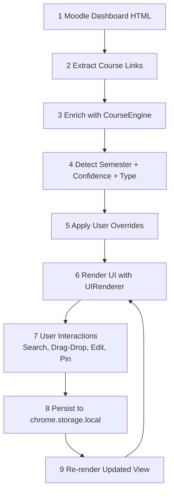
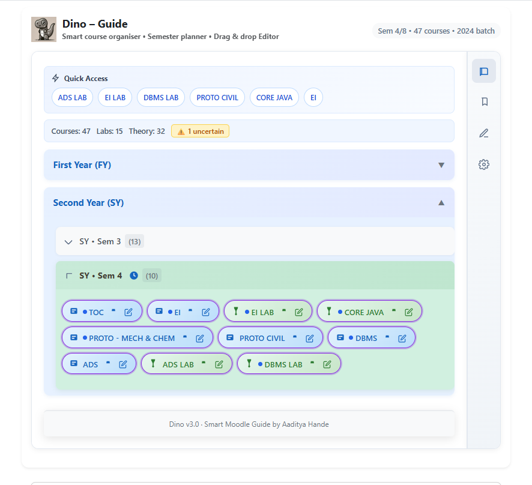
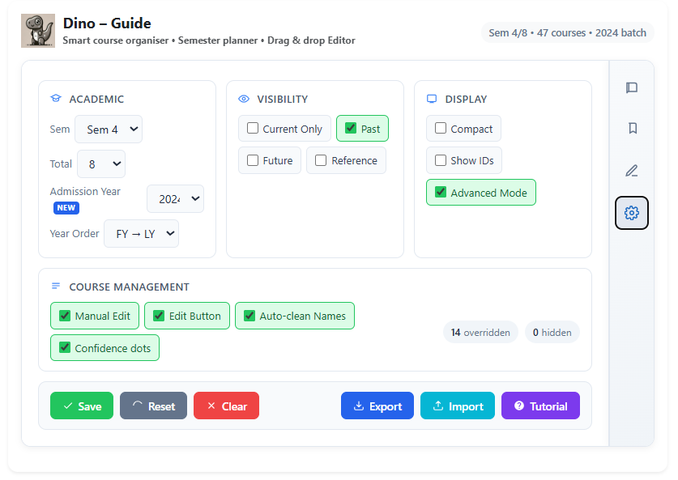
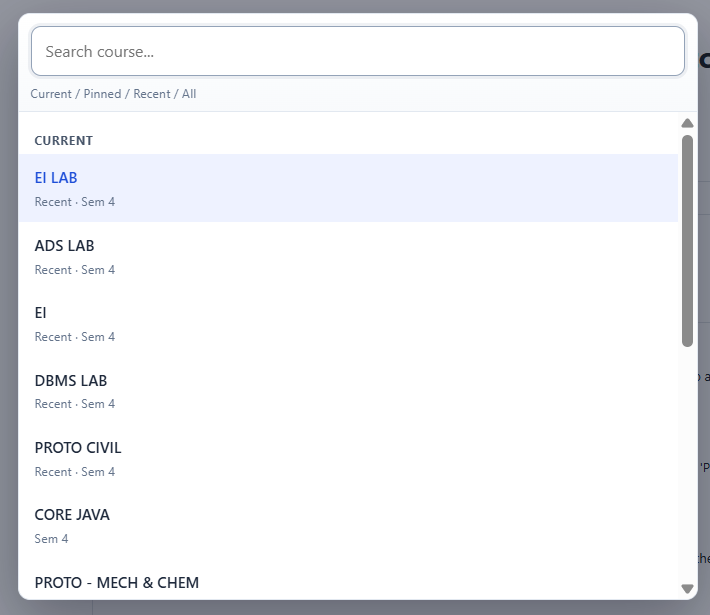

<a id="top"></a>

# DINO - One-Click Moodle Navigation System

🚀 Used by students at MITAOE

<p align="center">
  
</p>

<p align="center">
  <strong>Instant, one-click access to your courses - no scrolling, no searching.</strong><br>
  Press <strong>Ctrl + K</strong> → type → Enter → done.
</p>

<p align="center">
  
  
  
  
</p>

<p align="center">
  <a href="#install-now"><strong>Install now</strong></a> •
  <a href="#features"><strong>Features</strong></a> •
  <a href="#architecture"><strong>Architecture</strong></a> •
  <a href="#screenshots"><strong>Screenshots</strong></a>
</p>

---

## One-line Value Proposition
DINO turns Moodle's flat course list into a semester-aware command center with automatic detection, fast search, and user-controlled overrides.

## Overview
DINO transforms Moodle from a cluttered course list into a fast, structured navigation system.

It solves three recurring problems:
- Course sprawl: too many courses in one flat list.
- Naming inconsistency: semester labels are often noisy or ambiguous.
- Repetitive navigation: users keep scrolling and re-finding the same courses.

DINO restructures that workflow into a fast, persistent, semester-first system with a clean command-style entry point.

## Example Workflow

**Without DINO**
- Open dashboard
- Scroll through many courses
- Find the right subject manually
- Click

**With DINO**
- Press `Ctrl+K`
- Type `dbms`
- Press `Enter`
- Done

No dashboard. No scrolling. No friction.

---

<a id="features"></a>
## Key Features

### Core Features
- Automatic extraction of Moodle course links from dashboard HTML.
- Semester-based grouping across all 8 semesters.
- Year-level grouping (FY/SY/TY/LY) with current semester emphasis.
- Quick Access strip for current-semester course shortcuts.

### Intelligent Systems
- Admission-year based semester inference.
- Multi-stage detection pipeline:
  - year-logic first,
  - direct semester pattern next,
  - heuristic fallback last.
- Confidence scoring for inferred semester placement.
- Auto-cleaning of noisy Moodle names (AY tags, semester fragments, code prefixes).
- Automatic course type classification (theory vs lab).

### UX Enhancements
- Global command palette (`Ctrl+K`) with grouped results:
  - Current,
  - Pinned,
  - Recent,
  - All.
- Keyboard navigation in search results (up/down + enter).
- Onboarding flow with guided, step-by-step highlight tour.
- Smart insights strip (course count, lab/theory split, uncertainty warning).

### Customization and Control
- Advanced mode toggle for power workflows.
- Semester Editor with bulk assignment actions.
- Drag-and-drop course reassignment across semester buckets.
- Manual course creation for links outside extracted Moodle data.
- Per-course edit modal:
  - rename,
  - semester override,
  - type override,
  - notes,
  - hide/unhide,
  - delete (manual courses).
- Export/import full personalization state.

### Reliability and Safety
- Local-only persistence with `chrome.storage.local`.
- Sanitized HTML rendering and safe URL handling.
- Backward-compatible settings migration guards.
- Scope-limited injection to Moodle host and dashboard context.

---

<a id="architecture"></a>
## How It Works (Architecture)



Flow direction: top to bottom. The loop from persistence back to render is what keeps the UI stateful after each action.

### State Management
Core runtime state is held in `AppState` and persisted by key:
- Settings (`dino_settings_v1`)
- Overrides (`dino_overrides_v1`)
- Manual Courses (`dino_manual_courses_v1`)
- Preferences (`dino_course_prefs_v1`)
- Collapsed UI State (`dino_collapsed_state_v1`)
- Onboarding completion (`dino_onboarding_completed_v1`)

### Detection Engine
`CourseEngine` is DOM-free and handles:
- signal extraction,
- semester normalization (including roman numerals),
- year-term to absolute semester mapping,
- confidence scoring,
- type classification,
- normalization/cleanup.

### UI Layer
`UIRenderer` builds a tabbed experience:
- Courses
- Notes
- Editor
- Settings

Event wiring is delegated at container level to keep re-renders stable and lightweight.

### Persistence
All user modifications are durable and local:
- pin/recent behavior,
- course overrides,
- hidden states,
- notes,
- manual additions,
- editor assignments,
- display preferences.

---

## Key Innovations
DINO is not just an organizer; it is a navigation layer on top of Moodle.

- Behavior-aware ranking via pinning, open frequency, and recency.
- Confidence-first inference with visible uncertainty handling.
- Dual operating modes: simple by default, advanced when needed.
- Command-palette UX brought into an LMS workflow.

## Who Is This For
- Students with overloaded Moodle dashboards.
- Users who repeatedly access a small set of courses.
- Anyone who wants lower-friction navigation and clearer semester context.

## Real Use Case
A student opens Moodle, sees dozens of mixed courses, and loses time scanning.

With DINO:
- current-semester courses are highlighted,
- quick links are surfaced,
- misclassified items are corrected instantly,
- search is command-like and immediate.

---

<a id="screenshots"></a>
## Screenshots

<details>
<summary><strong>View screenshots</strong></summary>

### 1) Semester-Focused Course View
Year and semester grouping with current-term emphasis, quick-access chips, and editable course chips.

[](assets/screenshots/image1.png)

### 2) Settings Control Surface
Advanced mode controls for visibility, admission year, confidence indicators, and data import/export.

[](assets/screenshots/image2.png)

### 3) Ctrl+K Instant Search
Command-style search segmented into Current, Pinned, Recent, and All.

[](assets/screenshots/image3.png)

</details>

---

## Repository Structure
```text
dino/
├─ assets/
│  ├─ branding/
│  │  └─ dino.png
│  └─ screenshots/
│     ├─ image1.png
│     ├─ image2.png
│     └─ image3.png
├─ icons/
│  ├─ icon16.png
│  ├─ icon32.png
│  ├─ icon48.png
│  └─ icon128.png
├─ content.js
├─ dino.css
├─ manifest.json
└─ README.md
```

---

<a id="install-now"></a>
## Installation
1. Clone or download this repository.
2. Open Chrome and go to `chrome://extensions`.
3. Enable **Developer mode**.
4. Click **Load unpacked**.
5. Select the folder containing `manifest.json`.
6. Open Moodle and navigate to `/my/`.
7. Refresh the page and use the extension panel.

---

## Design Principles
- Friction reduction first.
- Context-aware grouping over flat lists.
- Personalization that persists.
- Progressive disclosure (simple mode -> advanced mode).
- Correctability over rigid automation.
- Local-first data handling.

---

## Future Improvements
- Optional sync profile for cross-device settings.
- Deeper metadata extraction (deadlines and assessment signals) where reliable.
- Override conflict diagnostics for clearer manual-vs-inferred state.
- Dedicated favorites/watchlist lane for high-priority courses.

---

## Tech Stack
- JavaScript
- Chrome Extensions API
- Manifest V3
- `chrome.storage.local`
- Content script + DOM parsing
- CSS UI layer

---

<p align="center">
  <a href="#top">Back to top</a>
</p>
